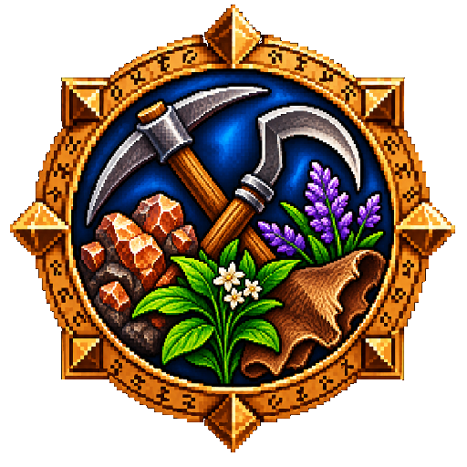

# Glimpse: Gathering

<p align="center"></p>

<p align="center">
  <a href="https://github.com/N3zr0k/Glimpse_Gathering/releases"></a>
  <a href="https://github.com/N3zr0k/Glimpse_Gathering/releases"></a>
  <a href="https://github.com/N3zr0k/Glimpse_Gathering/commits/main"></a>
  <a href="https://github.com/N3zr0k/Glimpse_Gathering/actions/workflows/ci.yml"></a>
</p>

Two addons that learn where crafting materials come from while you play, and show it in tooltips: how often a node or
creature drops what, and where to go to get an item.

Requires [Glimpse](https://github.com/N3zr0k/Glimpse) 0.3.14 or newer with Glimpse: Database. For WoW Forever
(interface 16001).

| Addon | Role |
| --- | --- |
| **Glimpse: GatheringDB** | Records gathering nodes and creature loot (crafting materials and gems, every attempt counts) in Glimpse: Database and offers the data to other addons through a small API. Shows nothing by itself, except raw numbers in debug mode. |
| **Glimpse: GatheringTooltip** | Shows drop chances and average amounts in the tooltips of nodes, creatures and crafting materials, including the best places to get an item (also fishing spots). Requires GatheringDB. |

## Contents

* [Features](#features)
* [Options](#options)
* [Commands](#commands)
* [Installation](#installation)
* [For developers](#for-developers)
* [Credits](#credits)
* [License](#license)

## Features

**Tooltip of a node or creature.** The drops you have recorded, one row per item with the chance, hits and attempts
(for example `50 %  (11/22)`) and the average amount per find:

```
Gathered
[icon] Silverleaf        93 %  (13/14)  Avg. 1.0
[icon] Earthroot         21 %  (3/14)   Avg. 1.4
```

Creatures show their normal loot and, if you know the profession, their skinning loot, each in its own section.

**Tooltip of a crafting material.** The best places to get it, ordered by where you can farm it best: your own zone
or instance first, then other zones on your continent by distance, then everything else, then sources without a
known place. Each row shows the source with an icon, its place in brackets, and the chance:

```
Places
[herb]  Silverleaf    (41, 57)  [pin] (Elwynn Forest - 120 yd)           93 %  (13/14)  Avg. 1.0
[bag]   Forest Wolf (Level 12)  (Darkshore - 2300 yd - GatherMate2)
```

* Coordinates and distance are shown in your own zone, zone and distance in other zones of your continent, only the
  zone elsewhere. A small marker shows the place where you are.
* A place that only comes from another addon (GatherMate2) shows no chance, because the chance comes from your own finds.
* A key (default Ctrl+G) sets a waypoint to the best place while the tooltip is shown: TomTom if it is installed,
  otherwise the game marker. No waypoint is possible for dungeons and raids (no coordinates).

### How the data is recorded

GatheringDB reads every loot window and keeps what is useful for crafting. The numbers are stored in Glimpse: Database
(namespace `gathering`), names of nodes, creatures and instances in GatheringDB itself.

| Source | What counts |
| --- | --- |
| Gathering nodes (herbs, ore, ...) | Every gathering cast that yields a crafting material. Mining the same node several times in a row, or after it respawned, counts every time. Chests do not count. |
| Creature loot | Every looted creature is one attempt, even without a crafting material (otherwise the chances would be too high). The same corpse does not count twice. |
| Skinning | Skinning is recognized by the spell that was just cast, or by a corpse that was already looted. |
| Fishing | Recorded by Glimpse: Professions (namespace `fishing`). GatheringDB only reads it, so the tooltips still show where a fish was caught. |
| Kills | Not stored. A kill (the `PARTY_KILL` event) without a loot window counts as an attempt after 2 minutes, but only if the corpse has no loot left. The kills themselves are counted by Glimpse: Statistics. |

* Only crafting materials and gems are stored; armour, weapons and junk are ignored.
* Creatures are stored by their ID, nodes by their object ID.
* Your own gathering counts (herbs, ore, other nodes, skinning) are kept per character as well.
* Data from a newer version is never touched, recording pauses until you update the addon.
* Data of older versions (up to 0.2.10) is taken over by Glimpse: Database on the first start; the old data stays
  untouched.

### Locations

GatheringDB also remembers **where** you looted: nodes with zone and coordinates (clustered into places), creatures
with their zone only; in dungeons and raids the instance itself. Switch it off with "Record locations".

If [GatherMate2](https://www.curseforge.com/wow/addons/gathermate2) is installed, its node locations are used as
well, after your own. They are read live, never saved and never exported. Nodes are matched by name, so it works in
every client language. Each source of outside locations has its own switch in the GatheringDB options.

### Export and import

Export, import and reset are part of Glimpse: Database (Glimpse options, tab Data). Shared data contains the world
knowledge (drops and places), not your own gathering counts.

## Options

Open them with `/gli config`, then Glimpse > Gathering.

**GatheringDB**

* Record gathering data (on/off), Record locations
* Use locations from other addons, with one switch per source (GatherMate2)
* Statistics (nodes, creatures, loot windows, locations, fishing zones)

**GatheringTooltip** (tabs)

* **General:** only learned professions, minimum number of attempts before a list is shown, only while Shift/Ctrl/Alt is held
* **Crafting materials**
  * Show the sources on items, number of places (1 to 10, default 3; a source in two zones counts twice)
  * Minimum chance for other zones
  * List sources with outside locations (GatherMate2) separately, confirmed finds first, or count them like your own
  * Display: icons in front of the sources (bag for loot, profession icons, `?` for other nodes) or headings instead;
    hits and attempts behind the chance; the place of each source in brackets (coordinates, distance)
  * Marker for your own place: five symbols and five colours to pick from, or off
  * Waypoint: the key (any combination of Ctrl, Shift, Alt and a key, checked against the game key bindings),
    optional hint line at the end of the tooltip
* **Target:** show nodes, creature loot, skinning loot, number of items per list; required skill on nodes and on
  creatures (own skill, coloured), only for learned professions, hide gray nodes

Distances use the unit chosen in the Glimpse options (General): automatic by client language, yards or metres.

## Commands

GatheringDB has no command of its own. The checks are probes of the Glimpse debugger:

| Command | Does |
| --- | --- |
| `/gli probe gathering stats` | Nodes, creatures, loot windows, locations, state of Glimpse: Database and the last error |
| `/gli probe gathering skill` | Your mining, herbalism and skinning skill with equipment bonus, and the target's creature type and skinning skill |
| `/gli probe gathering gm2` | Checks the GatherMate2 data and lists which of your nodes find a match |
| `/gli probe gathering area` | The detected position (map, coordinates, instance) |
| `/gli probe gathering names` | Number of stored names |
| `/gli probe gathering fishing [zone]` | Fishing loot of a zone (default: your zone) |
| `/gli probe gathering node <id>`, `npc <id>`, `item <id>` | Raw data of a node, a creature or the sources of an item |

With `/gli debug on` the tooltips of nodes, creatures and items show the raw recorded numbers and locations, and the
chat explains what was recorded or skipped and why. `/gli debug list` shows the categories of the debugger
`GatheringDB`, `/gli debug GatheringDB <category> on|off` switches one of them.

## Installation

Install Glimpse (with Glimpse: Database) first. Unpack the ZIP into the AddOns folder of the Forever client (during the beta, for example
`D:\Games\World of Warcraft\_classic_beta_\Interface\AddOns`, your install folder will differ). The ZIP contains
both folders `Glimpse_GatheringDB` and `Glimpse_GatheringTooltip`.

The data grows while you play; data of an older version is taken over on the first start. Optional: GatherMate2 (more locations) and TomTom (waypoints).

## For developers

GatheringDB offers its data to other addons through `Glimpse.GatheringDB` (drops, sources of an item, locations,
providers for outside locations), as a thin layer over Glimpse: Database. The API and the data format are described in
[DEVELOPER.md](DEVELOPER.md) (German).

The repository holds the two addon folders `Glimpse_GatheringDB/` and `Glimpse_GatheringTooltip/`; link both into the
AddOns folder (junction) and `/reload` after each change. The tests need the Glimpse repository next to this one (or
`GLIMPSE_DIR`). Checks:

```
lua tests/run.lua
luacheck .
python3 tools/check.py
```

## Credits

Author: N3zr0k. Special thanks to Flovy and sMash for testing.

The marker icons (`Glimpse_GatheringTooltip/Media/Markers`) are from [Flaticon](https://www.flaticon.com), recolored and converted to TGA:

- Pin: icon by Karacis from Flaticon, [source](https://www.flaticon.com/de/kostenloses-icon/ort_5338544)
- Solid pin: icon by Magnific from Flaticon, [source](https://www.flaticon.com/de/kostenloses-icon/standort_3699580)
- Outline pin: icon by Magnific from Flaticon, [source](https://www.flaticon.com/de/kostenloses-icon/ort_2794702)
- Person: icon by kawalanicon from Flaticon, [source](https://www.flaticon.com/de/kostenloses-icon/weiblicher-benutzer_18851090)
- Arrow: icon by Magnific from Flaticon, [source](https://www.flaticon.com/de/kostenloses-icon/navigation_3699548)

## License

MIT, see [LICENSE](LICENSE).
