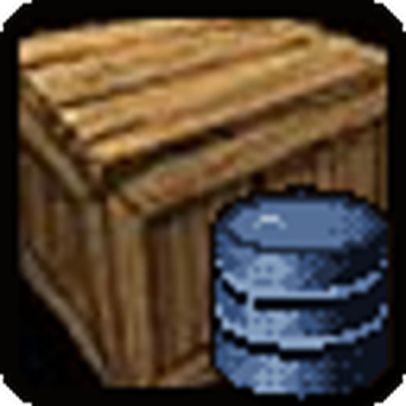
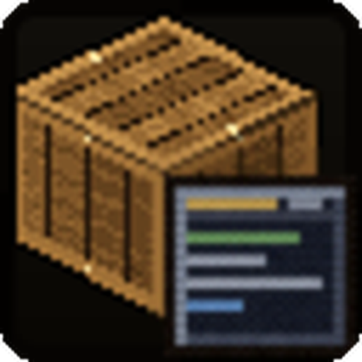

# Glimpse: Gathering

<p align="center"> </p>

Two addons for [Glimpse](https://github.com/N3zr0k/Glimpse) (0.2.2 or newer) that learn where crafting materials come
from while you play, and show it in tooltips: how often a node or creature drops what, and where to go to get an item.

| Addon | Role |
| --- | --- |
| **Glimpse: GatheringDB** | Records gathering nodes and creature loot (crafting materials and gems, every attempt counts) account-wide and offers the data to other addons through a small API. Shows nothing by itself, except raw numbers in debug mode. |
| **Glimpse: GatheringTooltip** | Shows drop chances and average amounts in the tooltips of nodes, creatures and crafting materials, including the best places to get an item. Requires GatheringDB. |

## Contents

* [What you get](#what-you-get)
* [How the data is recorded](#how-the-data-is-recorded)
* [Locations](#locations)
* [Options](#options)
* [Commands](#commands)
* [Export and import](#export-and-import)
* [Installation](#installation)
* [For developers](#for-developers)
* [Credits](#credits)

## What you get

**Tooltip of a node or creature.** The drops you have recorded, one row per item with the chance, hits and attempts
(for example `50 %  (11/22)`) and the average amount per find:

```
Gathered
[icon] Silverleaf        93 %  (13/14)  Avg. 1.0
[icon] Earthroot         21 %  (3/14)   Avg. 1.4
```

Creatures show their normal loot and, if you know the profession, their skinning loot, each in its own section.

**Tooltip of a crafting material.** The best places to get it, ordered by where you can farm it best: your own zone
or instance first, then other zones on your continent by distance, then everything else, then sources without a
known place. Each row shows the source with an icon, its place in brackets, and the chance:

```
Places
[herb]  Silverleaf    (41, 57)  [pin] (Elwynn Forest - 120 yd)           93 %  (13/14)  Avg. 1.0
[bag]   Forest Wolf (Level 12)  (Darkshore - 2300 yd - GatherMate2)
```

* Coordinates and distance are shown in your own zone, zone and distance in other zones of your continent, only the
  zone elsewhere. A small marker shows the place where you are.
* A place that only comes from another addon (GatherMate2) shows no chance, because the chance comes from your own finds.
* A key (default Ctrl+G) sets a waypoint to the best place while the tooltip is shown: TomTom if it is installed,
  otherwise the game marker. No waypoint is possible for dungeons and raids (no coordinates).

## How the data is recorded

GatheringDB reads every loot window and keeps what is useful for crafting. Everything is stored account-wide.

| Source | What counts |
| --- | --- |
| Gathering nodes (herbs, ore, ...) | Every gathering cast that yields a crafting material. Mining the same node several times in a row, or after it respawned, counts every time. Chests do not count. |
| Creature loot | Every looted creature is one attempt, even without a crafting material (otherwise the chances would be too high). The same corpse does not count twice. |
| Skinning | Skinning is recognized by the spell that was just cast, or by a corpse that was already looted. |
| Kills | Counted separately for every creature, independent of the attempts. A kill without a loot window counts as an attempt after 2 minutes, but only if the corpse has no loot left. |

* Only crafting materials and gems are stored; armour, weapons and junk are ignored. Fishing cannot be recorded
  (no loot source).
* Creatures are stored by their ID, nodes by their object ID.
* Damaged entries are cleaned up automatically and the data has a size limit (2000 nodes, 6000 creatures).
* Data from a newer version is never touched, recording pauses until you update the addon.

## Locations

GatheringDB also remembers **where** you looted (zone and coordinates, clustered into places; in dungeons and
raids the instance itself). Switch it off with "Record locations".

If [GatherMate2](https://www.curseforge.com/wow/addons/gathermate2) is installed, its node locations are used as
well, after your own. They are read live, never saved and never exported. Nodes are matched by name, so it works in
every client language. Each source of outside locations has its own switch in the GatheringDB options.

## Options

Open them with `/gli config`, then Glimpse > Gathering.

**GatheringDB**

* Record gathering data (on/off), Record locations
* Use locations from other addons, with one switch per source (GatherMate2)
* Statistics (nodes, creatures, loot windows, kills, locations), Reset data
* Export and import (see below)

**GatheringTooltip** (tabs)

* **General:** only learned professions, minimum number of attempts before a list is shown, only while Shift/Ctrl/Alt is held
* **Crafting materials**
  * Show the sources on items, number of places (1 to 10, default 3; a source in two zones counts twice)
  * Minimum chance for other zones
  * List sources with outside locations (GatherMate2) separately, confirmed finds first, or count them like your own
  * Display: icons in front of the sources (bag for loot, profession icons, `?` for other nodes) or headings instead;
    hits and attempts behind the chance; the place of each source in brackets (coordinates, distance)
  * Marker for your own place: five symbols and five colours to pick from, or off
  * Waypoint: the key (any combination of Ctrl, Shift, Alt and a key, checked against the game key bindings),
    optional hint line at the end of the tooltip
* **Target:** show nodes, creature loot, skinning loot, number of items per list

Distances use the unit chosen in the Glimpse options (General): automatic by client language, yards or metres.

## Commands

| Command | Does |
| --- | --- |
| `/gli gatheringdb stats` | Prints nodes, creatures, loot windows, kills and locations |
| `/gli gatheringdb export` | Shows all data as text to copy |
| `/gli gatheringdb import` | Opens the import window |
| `/gli gatheringdb reset` | Deletes all data |
| `/gli gatheringdb gm2` | Checks the GatherMate2 data and lists which of your nodes find a match |

With `/gli debug on` the tooltips of nodes, creatures and items show the raw recorded numbers and locations, and the
chat explains what was recorded or skipped and why.

## Export and import

All data can be exported as compressed text (`/gli gatheringdb export`, or the buttons in the options) and imported on
another account or computer. An import either **merges** (numbers are added, places combined) or **replaces** your data.
Imports of older data versions are converted automatically; data from a newer version is refused, and the same export
cannot be merged twice.

## Installation

Install Glimpse first. Unpack the ZIP into the AddOns folder of the Forever client (during the beta, for example
`D:\Games\World of Warcraft\_classic_beta_\Interface\AddOns`, your install folder will differ). The ZIP contains
both folders `Glimpse_GatheringDB` and `Glimpse_GatheringTooltip`.

The data starts empty and grows while you play. Optional: GatherMate2 (more locations) and TomTom (waypoints).

## For developers

GatheringDB offers its data to other addons through `Glimpse.GatheringDB` (drops, sources of an item, locations,
kills, export/import, providers for outside locations). The API and the data format are described in
[DEVELOPER.md](DEVELOPER.md) (German).

## Development

The repository contains the two addon folders at its top level. To work on it directly, clone it anywhere and link
both folders into the AddOns folder (see [DEVELOPER.md](DEVELOPER.md)). Checks:

```
lua tests/run.lua
luacheck .
python3 tools/check.py
```

## Credits

Special thanks to Flovy and sMash for testing.

The marker icons (`Glimpse_GatheringTooltip/Media/Markers`) are from [Flaticon](https://www.flaticon.com), recolored and converted to TGA:

- Pin: icon by Karacis from Flaticon, [source](https://www.flaticon.com/de/kostenloses-icon/ort_5338544)
- Solid pin: icon by Magnific from Flaticon, [source](https://www.flaticon.com/de/kostenloses-icon/standort_3699580)
- Outline pin: icon by Magnific from Flaticon, [source](https://www.flaticon.com/de/kostenloses-icon/ort_2794702)
- Person: icon by kawalanicon from Flaticon, [source](https://www.flaticon.com/de/kostenloses-icon/weiblicher-benutzer_18851090)
- Arrow: icon by Magnific from Flaticon, [source](https://www.flaticon.com/de/kostenloses-icon/navigation_3699548)

## License

MIT, see [LICENSE](LICENSE).
